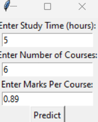

# 🎯 Student Performance Prediction

## 📌 Project Overview
This project predicts student performance based on the number of courses, study time, and marks per course. It provides a **Graphical User Interface (GUI)** using **Tkinter** to make predictions user-friendly and interactive. The model is trained using **Linear Regression** and implemented with **Scikit-Learn**.

---

## 🏗️ How It Works
1. The user inputs the **number of courses**, **study time (hours)**, and **marks per course**.
2. The trained **Linear Regression Model** predicts the student's overall marks.
3. The **Tkinter-based GUI** allows users to input data and receive predictions interactively.

🔹 **Machine Learning Algorithm Used:** Linear Regression
🔹 **Libraries Used:** NumPy, Pandas, Scikit-Learn, Tkinter, Joblib

---

## 🖥️ Project Structure
📁 **student-performance-analysis**
```
├── main.py                  # The main script for training the model
├── predict.py               # CLI-based prediction script
├── predict_ui.py            # Tkinter-based GUI for predictions
├── student_marks_predictor.pkl  # Saved trained model
├── README.md                # Project Documentation
├── input.png                # Screenshot of input fields in GUI
├── predicted_marks.png      # Screenshot of predicted marks output
└── .gitignore               # Files to ignore in Git
```

---

## 📊 Screenshots
### 📌 User Input Interface

_This is where users enter the number of courses, study time, and marks per course._

### 📌 Prediction Output

_The predicted marks based on the inputs provided._

---

## 🔧 Installation & Usage
### 1️⃣ Install Required Dependencies
Make sure you have Python installed, then run:
```bash
pip install numpy pandas scikit-learn joblib
```

### 2️⃣ Run the Tkinter GUI
To open the GUI and make predictions, run:
```bash
python predict_ui.py
```

### 3️⃣ Run CLI-Based Prediction
If you prefer a command-line interface, run:
```bash
python predict.py
```

---

## 🔬 Model Training Process
1️⃣ **Load the Dataset** → Student performance data is loaded using Pandas.
2️⃣ **Feature Engineering** → Extract relevant features: study time, number of courses, marks per course.
3️⃣ **Train Model** → A **Linear Regression** model is trained using Scikit-Learn.
4️⃣ **Save Model** → The trained model is saved using `joblib` for future predictions.
5️⃣ **Build GUI** → Tkinter is used to create an interactive interface for user input and result display.

---

## 🛠️ Tools & Technologies Used
- 🐍 **Python** – Core programming language
- 📊 **NumPy, Pandas** – Data manipulation
- 📉 **Scikit-Learn** – Machine Learning model
- 🖥️ **Tkinter** – GUI development
- 💾 **Joblib** – Model persistence
- 🛠️ **VS Code** – Code editor
- 🔗 **Git & GitHub** – Version control

---

## 🚀 Future Improvements
🔹 Enhance the UI with better design.
🔹 Add more features to improve prediction accuracy.
🔹 Deploy the application as a web-based tool using **Flask** or **Streamlit**.
🔹 Implement deep learning models for better accuracy.

---

## 📌 Author
👤 **[Your Name]**  
📧 your.email@example.com  
🌐 [GitHub Profile](https://github.com/yourusername)

---

## 🌟 Acknowledgments
🙏 Special thanks to **OpenAI**, **Scikit-Learn**, and **Python Community** for providing excellent resources!

### ⭐ Don't forget to **Star** this repository if you found it useful!

